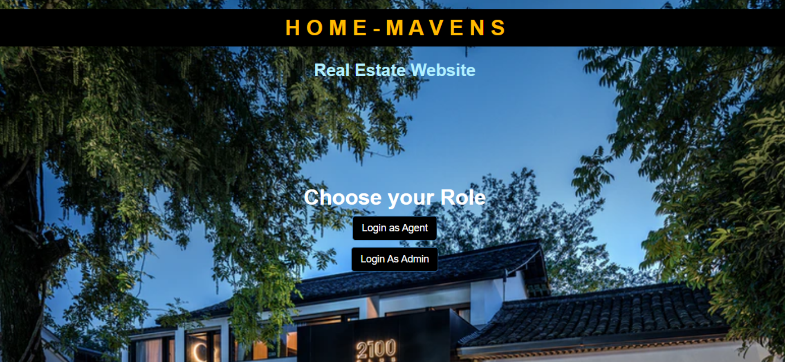

# REAL ESTATE WEBSITE

## RUN THE WEBSITE:
***

## ON WEB:
1. **GO TO https://home-mavens.herokuapp.com/**
* Select "Login as Agent" or "Login as Admin" button to go to their respective login pages.
* Agent credentials: 
    * Username: "29" 
    * Password: "password"
* Admin credentials: 
    * Username: "khushi20" 
    * Password: "dbms"
***
## ON YOUR MACHINE:
* Clone this repository on your local machine.
* Install Node.js and npm on your machine from here ( https://nodejs.org/en/download/ ). 
* Check for the succesfull installation using the command -> node -v and npm -v.
* Open command prompt and change the directory to the cloned directory and run command -> npm install.
* Use command -> node app.js to start the server.
* Open your favourite browser and goto http://localhost:8080/.
* Repeat above 3 steps as above again.
***
